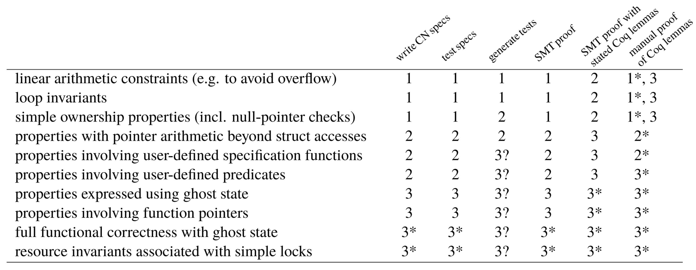
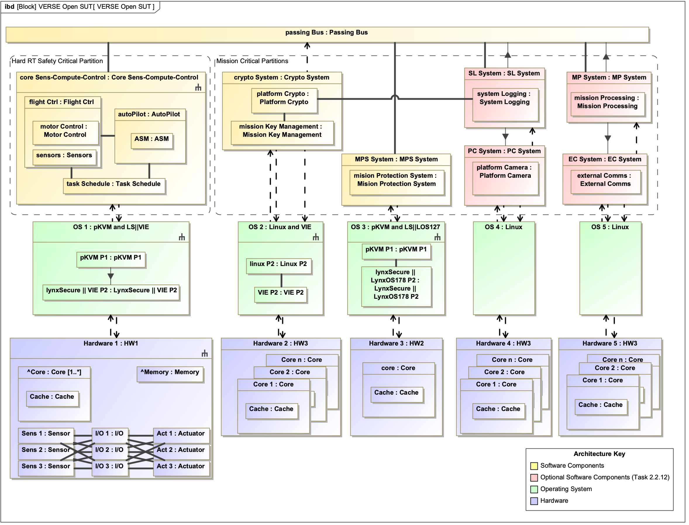

# VERSE-OpenSUT

Open System Under Test (OpenSUT) is a fictitious airborne platform that represents a notional high-consequence national security system. OpenSUT is used for evaluation and evolution of VERSE tools.

- [VERSE-OpenSUT](#verse-opensut)
  - [Introduction](#introduction)
    - [How to contribute](#how-to-contribute)
    - [Writing good requirements](#writing-good-requirements)
  - [Description](#description)
    - [Scenario 1: Boot OpenSUT to a known initial state](#scenario-1-boot-opensut-to-a-known-initial-state)
      - [Measured boot](#measured-boot)
      - [Attested boot](#attested-boot)
    - [Scenario 2: Load mission key](#scenario-2-load-mission-key)
      - [Scenario 2A: No adversary on the bus](#scenario-2a-no-adversary-on-the-bus)
      - [Scenario 2B: Adversary on the bus](#scenario-2b-adversary-on-the-bus)
    - [Scenario 3: Execute a mission](#scenario-3-execute-a-mission)
    - [Scenario 4: Decommission the OpenSUT](#scenario-4-decommission-the-opensut)
  - [Requirements](#requirements)
  - [Models](#models)
    - [Domain Model](#domain-model)
      - [Assurance Case](#assurance-case)
      - [Attestation](#attestation)
      - [Hypervisor](#hypervisor)
      - [Key Distribution](#key-distribution)
      - [Mission Keys](#mission-keys)
      - [pKVM](#pkvm)
      - [Root of Trust](#root-of-trust)
      - [Trusted Boot](#trusted-boot)
      - [Virtual Machine](#virtual-machine)
    - [Threat Model](#threat-model)
    - [SysMLv1 Model](#sysmlv1-model)
    - [AADL Model](#aadl-model)
  - [Code](#code)
  - [Proofs](#proofs)
  - [Components](#components)
    - [Autopilot](#autopilot)
    - [Message Bus](#message-bus)
    - [Mission Key Management (MKM)](#mission-key-management-mkm)
    - [Mission Protection System (MPS)](#mission-protection-system-mps)
    - [Platform Crypto](#platform-crypto)
    - [\[OPTIONAL\] Camera](#optional-camera)
    - [\[OPTIONAL\] External Comms](#optional-external-comms)
    - [\[OPTIONAL\] Mission Processing](#optional-mission-processing)
    - [\[OPTIONAL\] System Log](#optional-system-log)

## Introduction

This is a companion to the [VERSE Toolchain repository](https://github.com/GaloisInc/VERSE-Toolchain) for TA1.

[ [VERSE project proposal](https://drive.google.com/drive/u/0/folders/1S6wk-aXLZh_dNGU0IcKxB2tnXe5zjV1C) ]

### How to contribute

- Review the [code of conduct](CODE_OF_CONDUCT.md) and [developer guidelines](CONTRIBUTING.md).
- This repository uses [git submodules](https://github.blog/2016-02-01-working-with-submodules/), don't forget to run `git submodule update --init` after cloning the repository.

### Writing good requirements

First, read about how to write good requirements:
* QRA clear requirements [[PDF](./docs/QRA_Clear_Requirements.pdf)]
* [NASA's checklist](https://www.nasa.gov/reference/appendix-c-how-to-write-a-good-requirement/) (shorter)

Then, each requirement consists of:
* a unique identifier
* requirement body
* (optional) a rationale
* (optional) a parent requirement

## Description

Open System Under Test (OpenSUT) is a fictitious airborne platform that represents a notional high-consequence national security system. OpenSUT contains a [Mission Protection System](#mission-protection-system-mps) (MPS) which protects the (virtual) engine from getting outside of its safe operating conditions, a [Mission Key Management](#mission-key-management-mkm) system (MKM) that handles [mission keys](#mission-keys), platform [attestation](#attestation) and provides various cryptographic services provided by the [Platform Crypto](#platform-crypto). An [autopilot](#autopilot) provides basic flight control and waypoint following ability. The components communicate via point-to-point connections routed through a [message bus](#message-bus).

Additional *optional* components might be included, depending on the direction from the client. Those include a [camera](#optional-camera) that provides high-resolution video and a realistic amount of data, a [system logger](#optional-system-log) for logging system events at different classification levels, a [mission processing system](#optional-mission-processing) serving as the main mission computer, and [external comms](#optional-external-comms) for communicating with a fictional remote operator for unmanned platform operation.

We are intentionally ambiguous about some details, such as whether the OpenSUT is a manned or unmanned platform (it does have a basic autopilot), or whether it is a fixed wing or a [VTOL](https://en.wikipedia.org/wiki/VTOL). Depending on timing and client needs, we can adapt OpenSUT as necessary. We intent to build OpenSUT in a way that is similar to industry standards, such as *Open Mission Systems* ([OMS][]). This means having a publish-subscribe bus, and a well defined set of messages and interfaces.

OpenSUT [components](#components) can be thought of as the *application code*, and each component runs inside a [virtual machine](#virtual-machine). The components run on a one or more of host computers, where at least one is a multi-core CPU running multiple components, and one is a single core CPU hosting a Real-Time-Operating-System (RTOS) and running the [autopilot](#autopilot). Running the components in such a virtualized environment, including virtualized hardware, mirrors the architecture of real platforms.

OpenSUT uses a standard linux with [pKVM](#pkvm) support as a [hypervisor](#hypervisor), and while we realize that a standard linux kernel is not real-time capable and is not a certifiable for airworthiness, it is a good open substitute for [Lynx Secure](https://www.lynx.com/products/lynxsecure-separation-kernel-hypervisor) that we intend to use for the proprietary SUT in Phase 2.

All CPUs are ARM64 architecture, because pKVM supports only that instruction set. For easy deployment, we will emulate the host computers in QEMU instances. Some auxiliary processes, such as a flight simulator, are expected to run directly on the user's machine, or in separate docker containers.

OpenSUT shall operate in the following scenarios:

### Scenario 1: Boot OpenSUT to a known initial state

#### Measured boot

In this scenario, one or more components of OpenSUT boot using [SHAVE Trusted Boot](./components/platform_crypto/shave_trusted_boot/). It means that the application code is measured, hashed, and compared against a stored expected measure. Only if these values match, the application code is started. If they don't match, an error is thrown, the boot is aborted and an error message is possibly sent and logged. If the attestation of each securely booted component passes, the system will be in a known initial state, *fully provisioned*. Measured boot ensures that only the expected code is running on OpenSUT.

#### Attested boot

An optional - and more complex - attested boot may be added. During attested boot, the *last known measure* is stored in persistent memory, so it is known whether the system was booted from a known state in the past. Attestation requires a provisioned key, received from the [Mission Key Management](#mission-key-management-mkm) component, and the component [attests](#attestation) its state to the [Mission Key Management](#mission-key-management-mkm) (MKM) component.  The goal is to ensure that only the application code that has been signed by an external authority (e.g. the trusted component manufacturer) is running on the OpenSUT.

For the purpose of this scenario, we assume that each host computer contains a [root of trust](#root-of-trust), a [trusted boot](#trusted-boot) that can bring up the [hypervisor](#hypervisor). In other words, we assume the host OS to be *trusted* (see the [Threat model](#threat-model)). Because hardware root of trust, trusted boot and attestation are all complex topics, only the *application code* will be attested in this scenario.

We expect the code to be signed with [eXtended Merkle Signature Scheme](https://datatracker.ietf.org/doc/html/rfc8391) (XMSS), as XMSS is commonly used for firmware signing, and is believed to be [quantum safe](https://www.ibm.com/topics/quantum-safe-cryptography).

### Scenario 2: Load mission key

Once the platform is *fully provisioned*, load the [mission keys](#mission-keys) to the [Mission Key Management](#mission-key-management-mkm) component. The loading could happen through a direct UART connection to the MKM, or through the [message bus](#message-bus). In both cases, we expect the keys to be encrypted, such that they are never transported in plaintext.

The platform data have two different classification levels (*low* and *high*), the *low* data are unencrypted, while the *high* data are protected by the mission keys. The keys are used for the encryption of data both *in transit* (data sent between components) and *at rest* (e.g., stored in [System Log](#optional-system-log)). We expect the *high* key to be used for encrypting *high* data any time they are exchanged between components, and the *low* key is used to encrypt data logs. 

We intend to use the standard symmetric keys (e.g. AES256), as well as asymmetric key for a [post-quantum cryptographic](https://en.wikipedia.org/wiki/Post-quantum_cryptography) algorithm (e.g., [KYBER](https://en.wikipedia.org/wiki/Kyber) or Dilithium). We will choose an appropriate encryption scheme for the key transfer, key exchange, and for the data encryption.

#### Scenario 2A: No adversary on the bus

In this case, we assume there is no adversary on the bus, thus the messaging bus can be trusted. Because the bus is redundant, the messages are assumed to be always delivered correctly. In such case, mission keys can be exchanged directly between components.

#### Scenario 2B: Adversary on the bus

In this case, an adversary might be present on the bus, and is able to eavesdrop and alter/replay messages. As a result, a secure key distribution algorithm needs to be deployed for sharing mission keys.

### Scenario 3: Execute a mission

After the OpenSUT boots up, initializes to a known state, and loads mission keys, a mission plan is uploaded. The OpenSUT's autopilot then takes off, flies the mission following a set of waypoints, returns to land, and lands at the same position as it started from.


### Scenario 4: Decommission the OpenSUT

When a mission is completed, or when the OpenSUT is about to be shut down, ensure all data is properly saved to the [System Log](#optional-system-log). The system logs are then exported, and the keys are erased from the [Mission Key Management](#mission-key-management-mkm) component. Erase all sensitive data from the OpenSUT.

If the optional [System Log](#optional-system-log) is not selected by the client, we can build a minimal logging system utilizing a system log service on the Guest Linux OS. Both encrypted *high* messages and plaintext *low* messages are saved in the system log. An external *Management Interface* can then query the system logs from the component. After retrieving them, all mission data are deleted.


## Requirements

We will provide top level requirements, as well as refined requirements for each subsystem. Requirements shall be provided as a part of the Magic Draw SysML project, and exported into a plaintext format (likely Markdown) for easier viewing. We will track the requirements throughout the development process - ideally each line of the code, and each CN specification will be traceable to one of the top level requirements.

In Phase 1, we intend to verify the following properties of OpenSUT code:
- linear arithmetic constraints (e.g. to avoid overflow)
- loop invariants
- simple ownership properties (including null pointer check)

The list of all properties we intend to address during the program, and the respective Phases are shown below:



OpenSUT will be delivered with an [assurance case](#assurance-case), assembled with Adelard's Assurance and Safety Case Environment ([ASCE](https://www.adelard.com/asce/)). New change requests will add and/or change the top-level and derived requirements.

The basic top-level requirements for OpenSUT are under active development, in the meantime we have requirements for the [Mission Protection System](#mission-protection-system-mps) (MPS) in the MPS's [README](./components/mission_protection_system/README.md)


## Models

OpenSUT follows the best practices of [Rigorous Digital Engineering](https://galois.com/services/rigorous-digital-engineering/), providing rich models and executable specifications where applicable. The various models will include:

* a [Domain model](#domain-model) defining the most important domain concepts and serving as a glossary of terms
* a [Threat model](#threat-model) for OpenSUT
* a [SysMLv1 model](#sysmlv1-model) delivered as a Cameo/Magic draw project
* an [AADL model](#aadl-model) automatically generated from the SysML model
* combination of generated code and handwritten code annotated CN
* a test suite to validate and deploy the OpenSUT

### Domain Model

Domain model is a part of [Domain Engineering][], and is in its simplest form a [glossary](https://en.wikipedia.org/wiki/Glossary). For our purposes we can think of the domain model as an [ontology](https://en.wikipedia.org/wiki/Ontology_(information_science)). The domain model is expected to grow over time. Following are the most important OpenSUT *domain concepts*:

#### Assurance Case

From: https://csrc.nist.gov/glossary/term/assurance_case

> A reasoned, auditable artifact created that supports the contention that its top-level claim (or set of claims), is satisfied, including systematic argumentation and its underlying evidence and explicit assumptions that support the claim(s).

#### Attestation

* From: https://csrc.nist.gov/glossary/term/attestation

>  The process of providing a digital signature for a set of measurements securely stored in hardware, and then having the requester validate the signature and the set of measurements.

#### Hypervisor

* From: https://csrc.nist.gov/glossary/term/hypervisor

> The virtualization component that manages the guest OSs on a host and controls the flow of instructions between the guest OSs and the physical hardware.

#### Key Distribution

* From: https://csrc.nist.gov/glossary/term/key_distribution

> The transport of a key and other keying material from an entity that either owns or generates the key to another entity that is intended to use the key.

#### Mission Keys

Mission keys are a pair of [cryptographic keys](https://csrc.nist.gov/glossary/term/cryptographic_key), issued and valid for a particular mission. First key is used for protecting *high* (or *sensitive*) data *in transit* (i.e. when passed between OpenSUT components), while the second key is used to protect *high* data *at rest* (i.e. in the system log). The keys are typically a combination of one [symmetric key](https://csrc.nist.gov/glossary/term/symmetric_key), and one [asymmetric key](https://csrc.nist.gov/glossary/term/asymmetric_cryptography).

#### pKVM

* also known as **protected-KVM**
* From: https://source.android.com/docs/core/virtualization/security

> pKVM is a KVM-based hypervisor that isolates pVMs and Android into mutually distrusted execution environments. These properties hold in the event of a compromise within any pVM, including the host. Alternative hypervisors that comply with AVF need to provide similar properties.

#### Root of Trust

* From: https://csrc.nist.gov/glossary/term/roots_of_trust

> Highly reliable hardware, firmware, and software components that perform specific, critical security functions. Because roots of trust are inherently trusted, they must be secure by design. Roots of trust provide a firm foundation from which to build security and trust.


#### Trusted Boot

* From: https://csrc.nist.gov/glossary/term/trusted_boot

> A system boot where aspects of the hardware and firmware are measured and compared against known good values to verify their integrity and thus their trustworthiness.

#### Virtual Machine

* From: https://csrc.nist.gov/glossary/term/virtual_machine

> A simulated environment created by virtualization.


### Threat Model

We are assuming that the underlying emulated hardware, and the host OS are *trusted*, while the hypervisor and the virtual machines and all application code is generally *untrusted* and thus needs to be verified (unless otherwise noted). While this might seem as a strong assumption, it reflects the fact that proving the correctness of the hypervisor is out of scope for VERSE. More details about our assumptions can be found in the [EXPERIMENTAL SETUP](./docs/EXPERIMENTAL_SETUP.md) document. Note that while our [Scenario 1](#scenario-1-boot-opensut-to-a-known-initial-state) assumes that anything below the application code is *trusted*, otherwise our minimal secure boot would not be sufficient. We realize that this is at odds with the generally *untrusted* hypervisor and guest VM OS. We make an exception, and assume that the hypervisor's boot sequence is *trusted* and it can reliably bring up the application code.

The [hypervisor](#hypervisor) shall ensure space and time separation between components, so even if a single component is compromised, it can affect other components only through already available interfaces (e.g. a point-to-point connection). Note that neither the pKVM capable linux kernel, nor Lynx Secure has been formally verified, thus the time and space separation is only *assumed* at this point. However, pKVM is currently undergoing a formal verification (see [this paper](https://dl.acm.org/doi/pdf/10.1145/3571194) for details), and the Lynx Secure hypervisor holds a DO-178C DAL A certification​, ensuring a good quality of the code.

We assume that the connection between components that are on the *same host computer* to be *trusted*, but the [message bus](#message-bus) in *general* is *untrusted*. This will have some interesting implications for [attestation](#attestation), [key distribution](#key-distribution) and data transfer. We will elaborate the threat model as we implement each scenario. See [Scenario 2](#scenario-2-load-mission-key) for details.


### SysMLv1 Model

The SysML model is created in Cameo/MagicDraw v2022, and contains:

* [requirements](#requirements)
* top level architecture
* internal block diagrams
* behavioral diagrams (flows and state machines)

Below is a simple top-level SysML block diagram of OpenSUT. **Yellow** blocks contain the application code, and are described in [Components](#components) section. **Red** blocks denote *optional* components. **Green** blocks represent the [hypervisor](#hypervisor) and [pKVM](#pkvm) virtual machine guests. **Blue** blocks represent the underlying ARM64 hardware. The connections between the application components are notional, as any cross-component communication will need to pass through the hypervisor and use virtualized devices.



### AADL Model

We will export the SysML model into AADL with the [CAMET SysML2AADL bridge](https://camet-library.com/camet), in order to facilitate advanced analysis, such as:

* *Schedulability and Schedule generation* with FASTAR tool, to ensure that deadlines for all threads can be met, and a valid schedule (such as ARINC 653) can be generated
* *Multiple Independent Levels of Security* analysis with MILS tooling. It verifies that connected components operate at the same security level and that different security levels are separated with a protective measure like an air gap or an approved cross domain solution. This will be useful for validating that we are appropriately treating the *low* and *high* data

## Code

This repository provides both the model and the implementation of the OpenSUT. Our development practices and the branching structure are summarized in [CONTRIBUTING.md](./CONTRIBUTING.md). CI/CD will be added and expanded as our work progresses.

The main dependency will be a recent version of QEMU that can emulate an ARM64 platform, and a Linux-like OS that can at least run docker. We will use docker as much as possible to package the auxiliary processes, such as a flight simulator. We will provide documentation for installing dependencies and running OpenSUT scenarios.

The repository structure is as follows:

* `components` folder contains code for individual OpenSUT [components](#components) (the *application code*)
* `docs` folder contains related documents, figures, manuals and such
* `models` folder contains SysML and other models of OpenSUT
* `src` folder contains other, *non-application code* such as scripts for spinning up QEMU instances, pKVM virtual machines, test infrastructure etc.

The majority of the code is written in C and will have properties written in [CN](https://github.com/GaloisInc/VERSE-Toolchain?tab=readme-ov-file#cn).


## Proofs

OpenSUT uses [CN](https://github.com/GaloisInc/VERSE-Toolchain?tab=readme-ov-file#cn) for testing and verification of the application C code. The results of the testing and verification runs (such as logs, counterexamples and other artifacts) are attached to each CI run, and re-generated when OpenSUT is executed locally. Thus a OpenSUT user can easily reproduce out verification results.

We will utilize automated code generation when appropriate, for example use the [SysML model](#sysmlv1-model) for partial test generation, or the [AADL model](#aadl-model) to generate implementation stubs. For most components we have prior specification and models available, written in [Cryptol](https://cryptol.net/), [SAW](https://saw.galois.com/index.html) and/or [Frama-C](https://frama-c.com/). We convert these specifications into CN as a part of our work.

For example, below is a snippet of code from the [Mission Protection System](#mission-protection-system-mps). Function `get_actuation_state()` which reads the actuation signal, has Frama-C specs, that were translated into CN:

```C
// Reading actuation signals
//frama-c
/* @ requires i <= 1;
  @ requires device < NDEV;
  @ requires \valid(value);
  @ assigns *value;
  @ ensures (\result == 0) ==> (*value == 0 || *value == 1);
  @ ensures (\result != 0) ==> (*value == \old(*value));
*/
int get_actuation_state(uint8_t i, uint8_t device, uint8_t *value);
//CN
/*@ spec get_actuation_state(u8 i, u8 device, pointer value)
    requires i <= 1u8;
             device < NDEV();
             take vin = Owned<uint8_t>(value)
    ensures take vout = Owned<uint8_t>(value);
            ((return == 0i32) ? (vout == 0u8 || vout == 1u8) :
             (vout == vin))
@*/
```

Similarly, the function `ActuateActuator()` which controls the engine kill switch, has the following Frama-C and CN specifications:

```C
//frama-c spec function
/*@
  @ // Refines RTS::Actuator::ActuateActuator
  @ logic boolean ActuateActuator(uint8_t input) =
  @   ((input & 0x1) != 0) || ((input & 0x2) != 0);
  @ }
*/

// CN spec function
/*@
function (bool) ActuateActuator(u8 input) {
  ((bw_and_uf(input, 1u8) != 0u8) || (bw_and_uf(input, 2u8) != 0u8))
}
@*/

//frama-c
/* @ assigns \nothing;
  @ ensures \result == 0 || \result == 1;
  @ ensures \result == 1 <==> ((vs & 0x01) || (vs & 0x02));
  @ ensures ActuateActuator(vs) <==> \result == 1;
*/
uint8_t ActuateActuator(uint8_t vs);
//CN
/*@ spec ActuateActuator(u8 vs)
    requires true
    ensures (return == 0u8 || return == 1u8);
      return == 1u8 ? (bw_and_uf(vs, 1u8) != 0u8 || bw_and_uf(vs, 2u8) != 0u8) : true;
      iff(ActuateActuator(vs), return == 1u8)
 @*/
```

In some cases (such as the [Mission Computer](#mission-computer)) no existing specs are available. In those cases we will write CN specifications from scratch, and trace them towards the appropriate [requirements](#requirements).


## Components

Below we describe each component of the OpenSUT. Component implementation, specs, tests and proofs will be in [components](./components/) folder and/or the architecture model. The *Source* field points to the relevant code that the component might depend on, or that might serve as an inspiration for the component implementation.

Note that for the *baseline* version of OpenSUT, we highlight the expected functionality of each component, and point to the relevant sources where appropriate. Often the baseline components we refer to are already *high-assurance* with some sort of specification and/or formal verification. In such cases, we don't necessarily expect to add *more* assurance to the component with the CN properties, but we intend to highlight how much *faster* we can achieve comparable level of assurance with VERSE tools.


### Autopilot

* **Description:**
  * Flight controller for the platform. Has a certain level of autonomy (waypoint following).
  * Needs to be connected to flight simulator and simulated sensors (gyro, GPS, etc.)
  * It is an external codebase, we expect it will contain a number of bugs. However, we might be able to verify the interface code between the autopilot and the rest of OpenSUT, thus limiting the impact any of such bugs can have on the system
  * Note: a previous version of OpenSUT referenced *iNAV* as the autopilot of choice, because *iNAV* is written purely in C. However, iNAV does not support open source simulators for its *Software-In-The-Loop* ([SITL](https://github.com/iNavFlight/inav/blob/master/docs/SITL/SITL.md)) mode, which means OpenSUT with *iNAV* could not be run without having a license to one of the supported simulators. As a result, we were forced to switch back to Ardupilot as our autopilot.
* **Source:** https://github.com/ArduPilot/ardupilot/tree/Plane-4.5
* **Version:** [Plane 4.5](./components/autopilot/ardupilot/)
* **Primary language:** C++


### Message Bus

* **Description:**
  * P2P connection between endpoints provided by a SW layer. Link layer is handled by a fictitious redundant bus, ensuring packet delivery. Needs to support both *low* and *high* data. 
  * The message bus and the related interfaces should mimic the [OMS][] standard
  * We expect that the encryption of data will be handled by each component, such that we will not need to use any bus specific security.
* **Source:**
  * [ZeroMQ](https://zeromq.org/)'s [C implementation](https://zeromq.org/languages/c/)
  * Another possibility is [DroneCAN](https://dronecan.github.io/) and its C implementation [libcanard](https://dronecan.github.io/Implementations/Libcanard/)
* **Version:** [CZMQ v4.2.1](./components/message_bus/czmq/)
* **Primary language:** C


### Mission Key Management (MKM)

* **Description:**
  * Loads/stores/distributes mission keys, provisions the OpenSUT and provides cryptographic services from [Platform Crypto](#platform-crypto)
* **Primary language:** C
* **Source:**
  * [Galois Cryptol specs](https://github.com/GaloisInc/cryptol-specs) for various high-assurance cryptographic algorithms


### Mission Protection System (MPS)

* **Description:**
  * an engine protection system
  * redundant, measures engine temperature and pressure, and shuts down the engine if unsafe values are detected
* **Requirements:**
  * defined in the MPS [README](./components/mission_protection_system/README.md)
* **Source:**
  * [Galois HARDENS](https://github.com/GaloisInc/HARDENS)
* **Primary language:** C


### Platform Crypto

* **Description:**
  * Links as a library against MKM
  * Cryptographic library with high-assurance crypto algorithms
  * Contains implementation of [secure/trusted boot](#trusted-boot), used for measurement and attestation of application code
  * **NOTE:** While the algorithms themselves might be formally verified, we intend to write CN specifications for the most important API calls, thus preventing the application code from using the API incorrectly (which is a common source of bugs)
* **Source:**
  * [XMSS reference implementation](https://github.com/XMSS/xmss-reference)
  * [Project Everest](https://github.com/hacl-star/hacl-star/tree/main/dist) - a suite of formally verified cryptographic algorithms
  * [Galois Cryptol specs](https://github.com/GaloisInc/cryptol-specs) for additional high-assurance cryptographic algorithms
  * [Galois SHAVE trusted boot example](./components/platform_crypto/shave_trusted_boot/)
* **Primary language: C**

### [OPTIONAL] Camera

* **Description:**
  * a generic camera component, should require GPS location from the [Autopilot](#autopilot) to geotag the images
  * The goal of this component is to stress test the [System Log](#system-log) with a high-data rate video feed
* **Source:**
  * [CASE AADL tutorial](https://github.com/GaloisInc/CASE-AADL-Tutorial/tree/main)

### [OPTIONAL] External Comms

* **Description:**
  * C2C/Telemetry stream to a remote operator (e.g. a Ground Control Station).
* **Source:**
  * Potentially this comes from Sandia National Labs, as they developed a satellite communications board in a PROVERS seedling.  Noah Evans (`nevans@sandia.gov`) is the POC for this line of work.

### [OPTIONAL] Mission Processing

* **Description:**
  * This component serves as a *flight mission computer* - it is the main computer of the platform. Responsible for flying a mission (similar to the *Offboard* mode for PX4 autopilot)
  * This component is written from scratch
* **Primary language:** C

### [OPTIONAL] System Log

* **Description:**
  * A system logger
  * Concurrent & distributed, able to log at different classification levels (*low* and *high*).
  * Note that the JML specifications need to be translated to CN, and the Java code to be ported to C (at least a minimal subset)
* **Primary language:** Java (will be translated into C)
* **Source:**
  * [FreeAndFair Logging](https://github.com/FreeAndFair/logging/)

[Domain Engineering]: https://en.wikipedia.org/wiki/Domain_engineering
[OMS]: https://www.vdl.afrl.af.mil/programs/oam/oms.php
