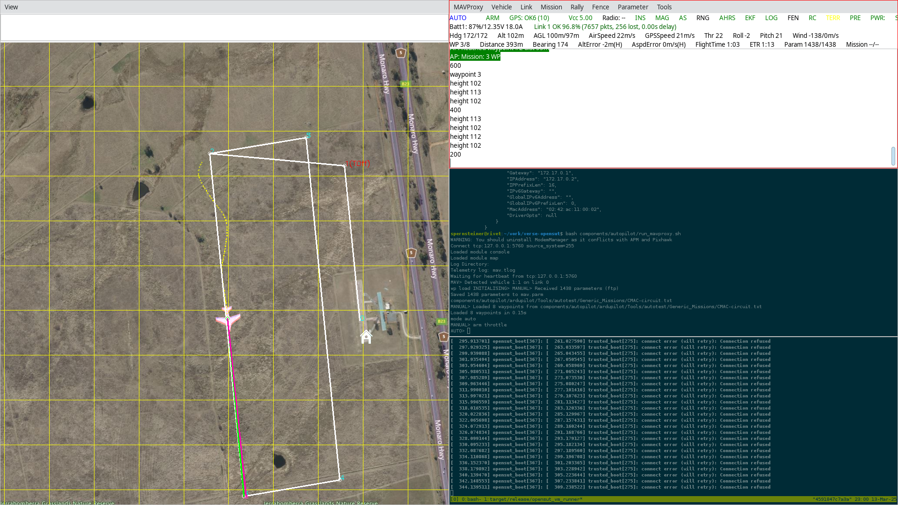
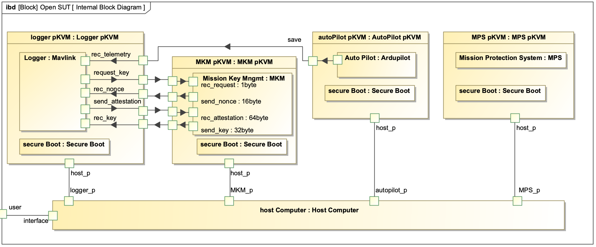
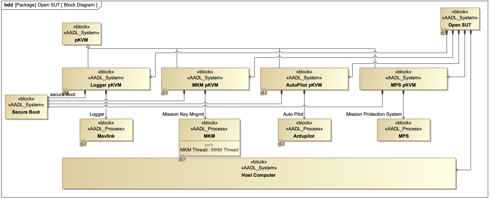

*This material is based upon work supported by the Air Force Research Laboratory (AFRL) and Defense Advanced Research Projects Agencies (DARPA) under Contract No. FA8750-24-C-B044.  Any opinions, findings, and conclusions or recommendations expressed in this material are those of the author(s) and do not necessarily reflect the views of the AFRL and DARPA.*

# VERSE-OpenSUT

Open System Under Test (OpenSUT) is a fictitious airborne platform that represents a notional high-consequence national security system. OpenSUT is used for evaluation and evolution of VERSE tools.

This is a companion repository to the [VERSE Toolchain repository](https://github.com/GaloisInc/VERSE-Toolchain) for TA1. You can find the VERSE project proposal [here](https://drive.google.com/drive/u/0/folders/1S6wk-aXLZh_dNGU0IcKxB2tnXe5zjV1C) (accessible only to the VERSE team).

- [VERSE-OpenSUT](#verse-opensut)
  - [Introduction](#introduction)
    - [Property classes](#property-classes)
    - [Security Claims](#security-claims)
    - [System properties](#system-properties)
    - [System metrics](#system-metrics)
  - [Scenarios](#scenarios)
    - [Scenario 1: Boot OpenSUT to a known initial state](#scenario-1-boot-opensut-to-a-known-initial-state)
    - [Scenario 2: Load mission key](#scenario-2-load-mission-key)
    - [Scenario 3: Execute a mission](#scenario-3-execute-a-mission)
    - [Scenario 4: Decommission the OpenSUT](#scenario-4-decommission-the-opensut)
  - [Requirements](#requirements)
  - [Change Events](#change-events)
  - [Models](#models)
    - [Domain Model](#domain-model)
    - [Threat Model](#threat-model)
    - [SysMLv1 Model](#sysmlv1-model)
    - [AADL Model](#aadl-model)
    - [Assurance Case](#assurance-case)
  - [Components](#components)
    - [Autopilot](#autopilot)
    - [Message Bus](#message-bus)
    - [Mission Key Management (MKM)](#mission-key-management-mkm)
    - [Mission Protection System (MPS)](#mission-protection-system-mps)
    - [pKVM](#pkvm)
    - [Secure Boot](#secure-boot)
    - [System Log](#system-log)
    - [\[OPTIONAL\] Camera](#optional-camera)
    - [\[OPTIONAL\] External Comms](#optional-external-comms)
    - [\[OPTIONAL\] Mission Processing](#optional-mission-processing)
  - [Code](#code)
  - [Proofs](#proofs)

## Introduction

Open System Under Test (OpenSUT) is a fictitious airborne unmanned platform that represents a notional high-consequence national security system. OpenSUT has a basic autopilot, and in our default configuration it is a fixed wing platform. OpenSUT was developed to provide an open-source system for testing and evaluation of VERSE tools, and provided very valuable feedback to the VERSE TA1 team.

The VERSE hypothesis is that a strong assurance toolchain will increase the assurance of low-assurance components, mitigate risk in third-party components, and maintain the high level of assurance in high-assurance components with lower time, effort, and expertise.

**IMPORTANT!** Please note that OpenSUT is merely a representative example of existing systems, and as a result it does *not* necessarily follow the best design and security practices as known today. Galois has previously demonstrated how to build systems that are *correct-by-construction* and inherently secure - this was demonstrated for example with the [SMACCMPILOT](https://smaccmpilot.org/) quadcopter on the [DARPA HACMS](https://www.galois.com/project/hacms) project. OpenSUT on the other hand represents a system that is *not* secure by design, and can showcase how TA1 tools help secure real defense systems.

OpenSUT [components](#components) can be thought of as the *application code*, and each component runs inside a [virtual machine](#virtual-machine). The components run on a one or more of host computers, with either multi-core CPUs running multiple components, or single core CPUs hosting a Real-Time-Operating-System (RTOS) and running a single component (typically the [autopilot](#autopilot)). Running the components in such a virtualized environment, including virtualized hardware, mirrors the architecture of real platforms. For demonstration purposes, we run all components in a single (emulated) host computer (represented by a docker image, see [OPENSUT_DOCKER.md](./docs/OPENSUT_DOCKER.md) for more details).

OpenSUT contains a [Mission Protection System](#mission-protection-system-mps) (MPS) which protects the (virtual) engine from getting outside of its safe operating conditions, a [Mission Key Management](#mission-key-management-mkm) system (MKM) that handles [mission keys](./models/DOMAIN_MODEL.md/#mission-keys), platform [attestation](./models/DOMAIN_MODEL.md/#attestation) and provides various cryptographic services provided by the [Platform Crypto](#platform-crypto), a [system logger](#system-log) for logging system events at different classification levels, and an [autopilot](#autopilot) provides basic flight control and waypoint following ability. The components communicate via point-to-point socket connections. Each component is started via [secure boot](#secure-boot) to ensure that only known components can be run.

OpenSUT uses a standard linux with [pKVM](#pkvm) support as a [hypervisor](#hypervisor), and while we realize that a standard linux kernel is not real-time capable and is not a certifiable for airworthiness, it is a good open substitute for [Lynx Secure](https://www.lynx.com/products/lynxsecure-separation-kernel-hypervisor) that we intend to use for the proprietary SUT in Phase 2. All CPUs are ARM64 architecture, because pKVM supports only that instruction set. For easy deployment, we will emulate the host computers in QEMU instances. Some auxiliary processes, such as a flight simulator, are expected to run directly on the user's machine, or in separate docker containers.

Below is an overview of OpenSUT. The (emulated) host computer is yellow, each pKVM virtual machine is light yellow, the secure boot is blue, and each component (application code) is purple.


### Property classes

As outlined in our proposal, we planned to address the following properties during the duration of the program:


The relevant properties addressed in Phase 1 are listed below, including their unique ID, which is used to track the properties in the code. Note that a single contract can span multiple property classes because of its complexity. Search for the property IDs in the source code to find the relevant contracts.

| Property ID              | Property name                                                | Supported in CN | Examples in OpenSUT | Number of contracts |
| -------------            | -------------                                                | -------------   | -------------   | -------------   |
| `@PropertyClass: P1-LAC` | linear arithmetic constraints                                | ✅ | ✅ | 69 |
| `@PropertyClass: P2-LIV` | Loop invariants                                              | ✅ | ✅ | 15 |
| `@PropertyClass: P3-SOP` | Simple ownership properties                                  | ✅ | ✅ | 170 |
| `@PropertyClass: P4-APA` | Properties with pointer arithmetic beyond struct accesses    | ✅ | ❌ | 0 |
| `@PropertyClass: P5-UDFunc` | Properties involving user-defined specification functions | ✅ | ✅ | 24 |
| `@PropertyClass: P6-UserDefPred` | Properties involving user-defined predicates         | ✅ | ✅ | 53 |
| `@PropertyClass: P7-GhostState` | Properties expressed using ghost state                | ❌ | ❌ | 0 |
| `@PropertyClass: P8-FuncPointer` | Properties involving function pointers               | ✅ | ✅ | 2 |
| `@PropertyClass: P9-FunCorGhost` | Full functional correctness with ghost state        | ❌ | ❌ | 0 |
| `@PropertyClass: P10-SimpleLocks` | Resource invariants associated with simple locks     | ✅ | ✅ | 2 |

Note that CN does not support ghost state at the moment. Ghost state can be mimicked with global variables, but we have not explored this option. `@PropertyClass: P9-FunCorGhost` depends on `@PropertyClass: P7-GhostState` and is currently not supported in CN.

### Security Claims

We claim that we mitigate the following CWEs for the code verified with VERSE tooling. We make no security claims about the un-verified code. To learn more about out threat model, please consult [THREAT_MODEL.md](./models/THREAT_MODEL.md)

1. [CWE-476](https://cwe.mitre.org/data/definitions/476.html): Null pointer dereference (#21 in [Top 25 CWEs](https://cwe.mitre.org/top25/archive/2024/2024_cwe_top25.html))
2. [CWE-125](https://cwe.mitre.org/data/definitions/125.html) and [CWE-&787](https://cwe.mitre.org/data/definitions/787.html): out of bounds read and write (#2 and #6 n [Top 25 CWEs](https://cwe.mitre.org/top25/archive/2024/2024_cwe_top25.html))
3. [CWE-1335](https://cwe.mitre.org/data/definitions/1335.html): Incorrect Bitwise Shift of Integer
4. [CWE-457](https://cwe.mitre.org/data/definitions/457.html): Use of Uninitialized Variable 
5. [CWE-191](https://cwe.mitre.org/data/definitions/191.html): Integer Underflow (Wrap or Wraparound)

### System properties

We claim that OpenSUT has the following properties. Note that the list is a combination of properties listed in our proposal (the relevant excerpt is [here](./docs/figures/provable_properties.png)), and relevant properties of interest which we identified (see [PROPERTIES_OF_INTERETS.md](./docs/PROPERTIES_OF_INTERETS.md) for more details). **NOTE:** we guarantee these properties *only* for the following components, and not all properties apply to all components:

* Mission Protection System (CI proof [here](https://github.com/GaloisInc/VERSE-OpenSUT/blob/main/.github/workflows/proofs.yml#L16))
* Secure Boot (CI proof [here](https://github.com/GaloisInc/VERSE-OpenSUT/blob/main/.github/workflows/proofs.yml#L51))
* Mission Key Management (CI proof [here](https://github.com/GaloisInc/VERSE-OpenSUT/blob/main/.github/workflows/proofs.yml#L70))


The **seven** proved properties are:

1. Code verified with `cn verify` is absent of undefined behavior, specifically:
   * signed integer over and underflow
   * use of an uninitialized variable
   * oversized shift amount
   * out of bounds array access
   * null pointer dereferencing
2. Code verified with `cn verify` properly encodes state machines. We have two examples:
   * correct [SHA256 API calls](https://github.com/GaloisInc/VERSE-OpenSUT/blob/main/components/platform_crypto/shave_trusted_boot/sha_256.h#L30) in *secure boot*
   * [Key Management state machine](https://github.com/GaloisInc/VERSE-OpenSUT/blob/main/components/mission_key_management/README.md#protocol) implementation in OpenSUT in [client.h](https://github.com/GaloisInc/VERSE-OpenSUT/blob/main/components/mission_key_management/client.h)
3. Functional correctness property: *linear arithmetic constraints* - e.g. [string processing in *trusted boot*](https://github.com/GaloisInc/VERSE-OpenSUT/blob/5da5cbcd710eadd1b3ad37a3253b0be0829a7f27/components/platform_crypto/shave_trusted_boot/trusted_boot.c#L752)
4. Functional correctness property: *loop invariants* - [zero initialize an array](https://github.com/GaloisInc/VERSE-OpenSUT/blob/main/components/mission_protection_system/src/common.c#L349) in *mission protection system* and actuation code in [actuation_logic.c](https://github.com/GaloisInc/VERSE-OpenSUT/blob/main/components/mission_protection_system/src/common.c#L349)
5. Functional correctness property: *simple ownership properties* - secure boot [attest()](https://github.com/GaloisInc/VERSE-OpenSUT/blob/44-trusted-boot/components/platform_crypto/shave_trusted_boot/firmware.c#L155)
6. Functional correctness property: *multidimensional array out-of-order access* in [actuation_collect_trips()](https://github.com/GaloisInc/VERSE-OpenSUT/blob/11-implement-mps/components/mission_protection_system/src/components/actuation_unit.c#L37)
7. Functional correctness property: *user defined specification functions* - [actuate_actuator()](https://github.com/GaloisInc/VERSE-OpenSUT/blob/main/components/mission_protection_system/src/include/actuate.h#L35) from the *mission protection system*


### System metrics

* The **Trusted Computing Base** of OpenSUT is as follows:
   * Debian Linux: emulated host computer, and OS running in each VM, providing system libraries for the components
   * [pKVM](https://source.android.com/docs/core/virtualization): used for virtualization of components, partially verified with CN [PDF](https://www.cl.cam.ac.uk/~nk480/cn.pdf)
   * [vm-runner](./src/vm_runner/README.md): Rust library that configures and spins up pKVM virtual machines, and loads the components
* **System complexity:**
  * The system components (excluding the autopilot, which was *not* developed by Galois or verified) are in the [components](./components/) directory:
    * **160 files** total (`.c` and `.h` files)
    * **24k LOC**
* **Number of contracts in total: 181**
  * **NOTE:** we count each function with CN specifications as *one* contract, even though the function might have many LOCs of CN specs and invariants
* **Count the number of contracts with requirements: 51**
  * **NOTE 1:** Some contracts are tagged with multiple requirements
  * **NOTE 2:** Some contracts are realized via multiple sub-contracts, in which case only the top-level contract is tagged with a requirement.
* **Number of requirements:**
  * OpenSUT has total of 84 requirements, where 51 are tied to specific CN contracts.
* **Compute the percentage of contracts tagged with a high-level requirement: 28%**

## Scenarios

OpenSUT shall operate in the following scenarios:

### Scenario 1: Boot OpenSUT to a known initial state

In this scenario, one or more components of OpenSUT boot using [SHAVE Trusted Boot](./components/platform_crypto/shave_trusted_boot/). It means that the application code is measured, hashed, and compared against an expected measure. Only if these values match, the application code is started and the measure is stored in the memory. If they don't match, an error is thrown, the boot is aborted and an error message is possibly sent and logged. If the attestation of each securely booted component passes, the system will be in a known initial state, *fully provisioned*. Measured boot ensures that only the expected code is running on OpenSUT.

The code is measured either with SHA256 or with [quantum safe](https://www.ibm.com/topics/quantum-safe-cryptography) [eXtended Merkle Signature Scheme](https://datatracker.ietf.org/doc/html/rfc8391) (XMSS).

For the purpose of this scenario, we assume that each host computer contains a [root of trust](#root-of-trust), a [trusted boot](#trusted-boot) that can bring up the [hypervisor](#hypervisor). In other words, we assume the host OS to be *trusted* (see the [Threat model](#threat-model)). Because hardware root of trust, trusted boot and attestation are all complex topics, only the *application code* will be attested in this scenario.

### Scenario 2: Load mission key

Once the platform is *fully provisioned*, components can request the [mission keys](#mission-keys) from the [Mission Key Management](#mission-key-management-mkm) (MKM) component. In this scenario the keys are loaded into MKM during the build process. In real systems the loading could happen through a direct UART connection to the MKM, or through the [message bus](#message-bus). In both cases, we expect the keys to be encrypted, such that they are never transported in plaintext.

The platform data have two different classification levels (*low* and *high*), the *low* data are unencrypted, while the *high* data are protected by the mission keys. The keys are used for the encryption of data both *in transit* (data sent between components) and *at rest* (e.g., stored in [System Log](#optional-system-log)). We expect the *high* key to be used for encrypting *high* data any time they are exchanged between components, and the *low* key is used to encrypt data logs. 

Each component requesting the keys from the MKM must first [attest](#attestation) its state to the MKM. The attestation protocol is described [here](./components/mission_key_management/README.md/). In this scenario, the logging component requests a *low* key to encrypt data-at-rest.

We intend to use the standard symmetric keys (e.g. AES256), and optionally an asymmetric key for a [pot-quantum cryptographic](https://en.wikipedia.org/wiki/Post-quantum_cryptography) algorithm (e.g., [KYBER](https://en.wikipedia.org/wiki/Kyber) or Dilithium). We assume there is no adversary on the bus, thus the messaging bus can be trusted. Because the bus is redundant, the messages are assumed to be always delivered correctly. In such case, mission keys can be exchanged directly between components.


### Scenario 3: Execute a mission

After the OpenSUT boots up, initializes to a known state, and loads mission keys, a mission plan is uploaded. The OpenSUT's autopilot then takes off, flies the mission following a set of waypoints, returns to land, and lands at the same position as it started from.



### Scenario 4: Decommission the OpenSUT

When a mission is completed, or when the OpenSUT is about to be shut down, ensure all data is properly saved to the [System Log](#system-log). The system logs are then exported, and the keys are erased from the [Mission Key Management](#mission-key-management-mkm) component. Erase all sensitive data from the OpenSUT. Practically for OpenSUT this means shutting down the VMs and saving log data to an encrypted disk that can be inspected after the mission.


## Requirements

We provide requirements in the [strictdoc](https://github.com/strictdoc-project/strictdoc) format. If you want to edit [REQUIREMENTS.sdoc](./REQUIREMENTS.sdoc) you will need to [install strictdocs](https://strictdoc.readthedocs.io/en/stable/stable/docs/strictdoc_01_user_guide.html#SDOC_UG_GETTING_STARTED). Otherwise, we provide the exported requirements in [PDF](./REQUIREMENTS.pdf) and [RST](./REQUIREMENTS.rst) formats. We also provide [a ReqIf export](./REQUIREMENTS.reqif) for easy import to Cameo and other system engineering tools.  Requirements implemented in the code are traced back with `// Implements: TA2-REQ-123...` statement. The requirements are also listed in each component's README.


## Change Events

We performed two change events, listed below:

* **Change Event 1: Change SHA to XMSS in Secure boot**
  * Tracking issue: [#125](https://github.com/GaloisInc/VERSE-OpenSUT/issues/125)
* **Change event 2: Add network functionality to MPS**
  * Tracking issue: [#126](https://github.com/GaloisInc/VERSE-OpenSUT/issues/126)


## Models

OpenSUT follows the best practices of [Rigorous Digital Engineering](https://galois.com/services/rigorous-digital-engineering/), providing rich models and executable specifications where applicable. The various models will include:

* a [Domain model](#domain-model) defining the most important domain concepts and serving as a glossary of terms
* a [Threat model](#threat-model) for OpenSUT
* a [SysMLv1 model](#sysmlv1-model) delivered as a Cameo/Magic draw project
* an [AADL model](#aadl-model) automatically generated from the SysML model
* combination of generated code and handwritten code annotated CN
* a test suite to validate and deploy the OpenSUT

### Domain Model

Domain model is a part of [Domain Engineering][], and is in its simplest form a [glossary](https://en.wikipedia.org/wiki/Glossary). For our purposes we can think of the domain model as an [ontology](https://en.wikipedia.org/wiki/Ontology_(information_science)). The domain model is provided in [DOMAIN_MODEL.md](./models/DOMAIN_MODEL.md).


### Threat Model

We provide a detailed threat model in [THREAT_MODEL.md](./models/THREAT_MODEL.md).


### SysMLv1 Model

The SysML model is created in Cameo/MagicDraw v2022, and contains:

* [requirements](#requirements)
* top level architecture
* internal block diagrams
* activity diagrams

Below is a top-level SysML block diagram of the *proposed* OpenSUT, including the *optional* components. **Yellow** blocks contain the application code, and are described in [Components](#components) section. **Red** blocks denote *optional* components. **Green** blocks represent the [hypervisor](#hypervisor) and [pKVM](#pkvm) virtual machine guests. **Blue** blocks represent the underlying ARM64 hardware. The connections between the application components are notional, as any cross-component communication will need to pass through the hypervisor and use virtualized devices.


The realized OpenSUT contains only one optional component (system logger), and runs on a single emulated multi-core CPU. Below is the internal block diagram and the block diagram of the released OpenSUT:





The MKM activity diagram is shown below:


### AADL Model

The AADL model was generated from the SysML model with the [CAMET SysML2AADL bridge](https://camet-library.com/camet), and annotated with GUMBO contract language. The AADL model can be used to facilitate advanced analysis, such as:

* *Schedulability and Schedule generation* with FASTAR tool, to ensure that deadlines for all threads can be met, and a valid schedule (such as ARINC 653) can be generated
* *Multiple Independent Levels of Security* analysis with MILS tooling. It verifies that connected components operate at the same security level and that different security levels are separated with a protective measure like an air gap or an approved cross domain solution. This will be useful for validating that we are appropriately treating the *low* and *high* data

The model is located in the [AADL directory](./models/AADL/), and can be loaded as a project in [Osate](https://osate.org/). An example of the GUMBO contract, implementing a MKM requirement is shown below:

```aadl
...
case recieveBadKeyID "If not 1byte or no table match close connection
                  | (TA2-REQ-69, TA2-REQ-71 & TA2-REQ-66)":
  assume currentState == CS_RECV_KEY_ID &&
                        (bufferItem.size != KEY_ID_SIZE() ||
                        ! mkmTableHas(bufferItem)
                        );
  guarantee nextState == CS_DONE;

case sendRandomNonce "(TA2-REQ-70)":
  assume currentState == CS_SEND_CHALLENGE;
  guarantee nextState == CS_RECV_RESPONSE;
...
```

### Assurance Case

OpenSUT is delivered with an *assurance case*, assembled with NASA's [AdvoCATE](https://assured-autonomy.org/tools/advocate) tool. The assurance case is available in the [models/AssuranceCase](./models/AssuranceCase) folder, and is generated from the [RESOLUTE](https://loonwerks.com/tools/resolute.html) annex annotations in the AADL model (see the [RESOLUTE User guide](https://github.com/loonwerks/Resolute/blob/master/org.osate.resolute.help/src/guide/user_guide.md#export-to-advocate))


## Components

Below we describe each component of the OpenSUT. Component implementation, specs, tests and proofs will be in [components](./components/) folder and/or the architecture model. The *Source* field points to the relevant code that the component might depend on, or that might serve as an inspiration for the component implementation.

Note that for the *baseline* version of OpenSUT, we highlight the expected functionality of each component, and point to the relevant sources where appropriate. Often the baseline components we refer to are already *high-assurance* with some sort of specification and/or formal verification. In such cases, we don't necessarily expect to add *more* assurance to the component with the CN properties, but we intend to highlight how much *faster* we can achieve comparable level of assurance with VERSE tools.


### Autopilot

* **Description:**
  * Flight controller for the platform. Has a certain level of autonomy (waypoint following).
  * Needs to be connected to flight simulator and simulated sensors (gyro, GPS, etc.)
  * It is an external codebase, we expect it will contain a number of bugs. However, we might be able to verify the interface code between the autopilot and the rest of OpenSUT, thus limiting the impact any of such bugs can have on the system
  * Note: a previous version of OpenSUT referenced *iNAV* as the autopilot of choice, because *iNAV* is written purely in C. However, iNAV does not support open source simulators for its *Software-In-The-Loop* ([SITL](https://github.com/iNavFlight/inav/blob/master/docs/SITL/SITL.md)) mode, which means OpenSUT with *iNAV* could not be run without having a license to one of the supported simulators. As a result, we were forced to switch back to Ardupilot as our autopilot.
* **Source:** https://github.com/ArduPilot/ardupilot/tree/Plane-4.5
* **Version:** [Plane 4.5](./components/autopilot/ardupilot/)
* **Primary language:** C++
* **Target:** Arduplane [SITL](https://ardupilot.org/dev/docs/sitl-simulator-software-in-the-loop.html)
* **Simulation environment:** [JSBSim](https://ardupilot.org/dev/docs/sitl-with-jsbsim.html)
  * JSBSim will run on the base platform, or on a separate machine for performance reasons
  * a separate UDP channel for environment data will need to be opened on the Guest VM and forwarded to the base platform - this channel is assumed to be out of scope for attacks, as in real platform the simulated sensors would be replaced with the real ones
* Started as high assurance? **No**
* Based on the OpenSUT [scenarios](../README.md#description), the autopilot is providing only adjacent functionality to the OpenSUT. The primary use case of the OpenSUT is correctly booting the system, and then loading keys and managing sensitive information. Flying a mission with the autopilot is the 3rd scenario in the list.
* Because of that, and because the code is in C++ we are **not** planning to verify the autopilot with TA1 tools. If some critical bugs that would be relevant to the OpenSUT scenarios are found, we will address them, but otherwise we do not expect to change the Ardupilot code in Phase 1

### Message Bus

P2P connection between endpoints provided by a SW layer. Link layer is handled by a fictitious redundant bus, ensuring packet delivery. Needs to support both *low* and *high* data. We originally planned to use [ZeroMQ](https://zeromq.org/)'s [C implementation](https://zeromq.org/languages/c/), but instead we use a simple socket connection between components, utilizing standard Linux network stack. This configuration allows us to express all relevant properties and provides needed functionality, without the need of additional 3rd party library.


### Mission Key Management (MKM)

* **Description:**
  * Distributes mission keys to components that can attest their configuration (see the [README](./components/mission_key_management/README.md) for details)
* **Primary language:** C
* **Source:**
  * the component is written from scratch

### Mission Protection System (MPS)

* **Description:**
  * an engine protection system
  * redundant, measures engine temperature and pressure, and shuts down the engine if unsafe values are detected
* **Requirements:**
  * defined in the MPS [README](./components/mission_protection_system/README.md)
* **Source:**
  * [Galois HARDENS](https://github.com/GaloisInc/HARDENS)
* **Primary language:** C
* Started as high assurance? **Yes**
* Version: [HARDENS @ 54ac1d8](../components/mission_protection_system/HARDENS/)
* Hypothesis:
  * *Final version will have the same or fewer vulnerabilities; applying TA1 tools will establish similarly high assurance at lower cost than in the original component.*
* Scoping:
  * The baseline version of MPS is the original HARDENS code. MPS will be our first ported component, and adapting the HARDENS code for MPS will be our first change event. The expected delivery of a verified MPS is on 2024-05-31


### pKVM

* Started as high assurance? **No**
* Version: `pkvm-core-6.4`
* Hypothesis:
  * *Final version will have fewer vulnerabilities, **if** we apply TA1 tools will to mitigate vulnerabilities in the pKVM, beyond what has already been verified.*
* Scoping:
  * The partially verified branch is `pkvm-verif-6.4` (see [this paper](https://dl.acm.org/doi/pdf/10.1145/3571194) for details)
  * We might be verifying more of the pKVM code, but it is not the primary focus of Phase 1 (as mentioned in the [README](../README.md) we are primarily focusing on the application code)


### Secure Boot

* **Description:**
  * Contains implementation of *secure boot*, used for measurement and attestation of application code
  * Uses high-assurance crypto algorithms
  * **NOTE:** While the algorithms themselves might be formally verified, we intend to write CN specifications for the most important API calls, thus preventing the application code from using the API incorrectly (which is a common source of bugs)
* **References:**
  * [XMSS reference implementation](https://github.com/XMSS/xmss-reference)
  * [Project Everest](https://github.com/hacl-star/hacl-star/tree/main/dist) - a suite of formally verified cryptographic algorithms
  * [Galois Cryptol specs](https://github.com/GaloisInc/cryptol-specs) for additional high-assurance cryptographic algorithms
  * [Galois SHAVE trusted boot example](./components/platform_crypto/shave_trusted_boot/)
* **Primary language: C**
* Started as high assurance? **Yes**
* Version: [baseline-v0.1](https://github.com/GaloisInc/VERSE-OpenSUT/tree/262cd7b435ac97bd00d647a5b53e50a5d61b6f7b/components/platform_crypto/shave_trusted_boot)
* Hypothesis:
  * *Final version will have the same or fewer vulnerabilities; applying TA1 tools will establish similarly high assurance at lower cost than in the original component.*
* Scoping:
  * We intend to use the SHAVE Trusted Boot for attesting the application code before launching it. It is using a variation of SHAVE Trusted Boot to start most of the components.

### System Log

* **Description:**
  * A system logger
  * Concurrent & distributed, able to log at different classification levels (*low* and *high*).
  * Note that the JML specifications need to be translated to CN, and the Java code to be ported to C (at least a minimal subset)
* **Primary language:** Java (will be translated into C)
* **Source:**
  * [FreeAndFair Logging](https://github.com/FreeAndFair/logging/)

[Domain Engineering]: https://en.wikipedia.org/wiki/Domain_engineering
[OMS]: https://www.vdl.afrl.af.mil/programs/oam/oms.php

### [OPTIONAL] Camera

* **Description:**
  * a generic camera component, should require GPS location from the [Autopilot](#autopilot) to geotag the images
  * The goal of this component is to stress test the [System Log](#system-log) with a high-data rate video feed
* **Source:**
  * [CASE AADL tutorial](https://github.com/GaloisInc/CASE-AADL-Tutorial/tree/main)

### [OPTIONAL] External Comms

* **Description:**
  * C2C/Telemetry stream to a remote operator (e.g. a Ground Control Station).
* **Source:**
  * Potentially this comes from Sandia National Labs, as they developed a satellite communications board in a PROVERS seedling.  Noah Evans (`nevans@sandia.gov`) is the POC for this line of work.

### [OPTIONAL] Mission Processing

* **Description:**
  * This component serves as a *flight mission computer* - it is the main computer of the platform. Responsible for flying a mission (similar to the *Offboard* mode for PX4 autopilot)
  * This component is written from scratch
* **Primary language:** C

## Code

This repository provides both the model and the implementation of the OpenSUT. Our development practices and the branching structure are summarized in [CONTRIBUTING.md](./CONTRIBUTING.md). CI/CD will be added and expanded as our work progresses.

The main dependency will be a recent version of QEMU that can emulate an ARM64 platform, and a Linux-like OS that can at least run docker. We will use docker as much as possible to package the auxiliary processes, such as a flight simulator. We will provide documentation for installing dependencies and running OpenSUT scenarios.

The repository structure is as follows:

* `components` folder contains code for individual OpenSUT [components](#components) (the *application code*)
* `docs` folder contains related documents, figures, manuals and such
* `models` folder contains SysML and other models of OpenSUT
* `src` folder contains other, *non-application code* such as scripts for spinning up QEMU instances, pKVM virtual machines, test infrastructure etc.

The majority of the code is written in C and will have properties written in [CN](https://github.com/GaloisInc/VERSE-Toolchain?tab=readme-ov-file#cn).


## Proofs

OpenSUT uses [CN](https://github.com/GaloisInc/VERSE-Toolchain?tab=readme-ov-file#cn) for testing and verification of the application C code. The results of the testing and verification runs (such as logs, counterexamples and other artifacts) are attached to each CI run, and re-generated when OpenSUT is executed locally. Thus a OpenSUT user can easily reproduce out verification results.

We will utilize automated code generation when appropriate, for example use the [SysML model](#sysmlv1-model) for partial test generation, or the [AADL model](#aadl-model) to generate implementation stubs. For most components we have prior specification and models available, written in [Cryptol](https://cryptol.net/), [SAW](https://saw.galois.com/index.html) and/or [Frama-C](https://frama-c.com/). We convert these specifications into CN as a part of our work.

For example, below is a snippet of code from the [Mission Protection System](#mission-protection-system-mps). Function `get_actuation_state()` which reads the actuation signal, has Frama-C specs, that were translated into CN:

```C
// Reading actuation signals
//frama-c
/* @ requires i <= 1;
  @ requires device < NDEV;
  @ requires \valid(value);
  @ assigns *value;
  @ ensures (\result == 0) ==> (*value == 0 || *value == 1);
  @ ensures (\result != 0) ==> (*value == \old(*value));
*/
int get_actuation_state(uint8_t i, uint8_t device, uint8_t *value);
//CN
/*@ spec get_actuation_state(u8 i, u8 device, pointer value)
    requires i <= 1u8;
             device < NDEV();
             take vin = Owned<uint8_t>(value)
    ensures take vout = Owned<uint8_t>(value);
            ((return == 0i32) ? (vout == 0u8 || vout == 1u8) :
             (vout == vin))
@*/
```

Similarly, the function `ActuateActuator()` which controls the engine kill switch, has the following Frama-C and CN specifications:

```C
//frama-c spec function
/*@
  @ // Refines MPS::Actuator::ActuateActuator
  @ logic boolean ActuateActuator(uint8_t input) =
  @   ((input & 0x1) != 0) || ((input & 0x2) != 0);
  @ }
*/

// CN spec function
/*@
function (bool) ActuateActuator(u8 input) {
  ((bw_and_uf(input, 1u8) != 0u8) || (bw_and_uf(input, 2u8) != 0u8))
}
@*/

//frama-c
/* @ assigns \nothing;
  @ ensures \result == 0 || \result == 1;
  @ ensures \result == 1 <==> ((vs & 0x01) || (vs & 0x02));
  @ ensures ActuateActuator(vs) <==> \result == 1;
*/
uint8_t ActuateActuator(uint8_t vs);
//CN
/*@ spec ActuateActuator(u8 vs)
    requires true
    ensures (return == 0u8 || return == 1u8);
      return == 1u8 ? (bw_and_uf(vs, 1u8) != 0u8 || bw_and_uf(vs, 2u8) != 0u8) : true;
      iff(ActuateActuator(vs), return == 1u8)
 @*/
```

In some cases (such as the [Mission Computer](#mission-computer)) no existing specs are available. In those cases we will write CN specifications from scratch, and trace them towards the appropriate [requirements](#requirements).
