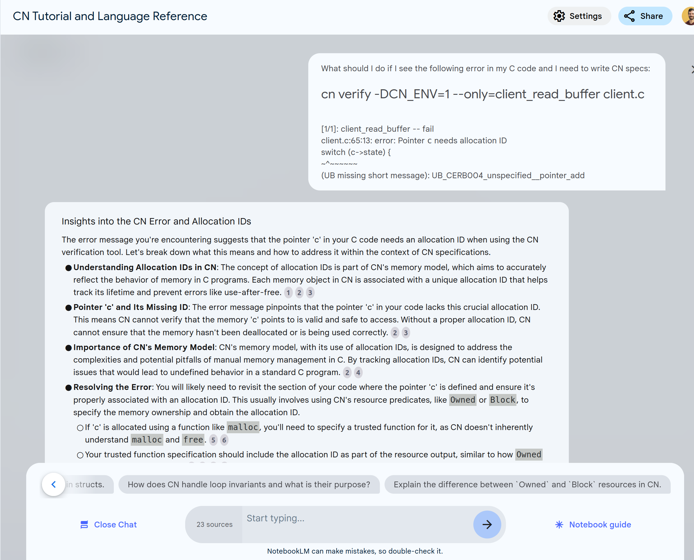

# AI experiments with CN

## OpenAI ChatGPT

I attempted to use [OpenAI Assistant API](https://platform.openai.com/docs/assistants/overview) which seems suitable for this task. Ideally, we would add a [custom function call](https://platform.openai.com/docs/guides/function-calling#function-calling-with-structured-outputs) that would call to `cn verify` to test the validity of the output. [openai-quickstart-python](https://github.com/openai/openai-quickstart-python/) has all the components to get started quickly. However, as a first step, I manually interacted with the ChatGPT chat.

I attempted to feed ChatGPT with CN grammar, the tutorial and relevant subset of the tutorial example, hoping that will provide enough data to *fine-tune* the GPT for this task. I used ChatGPT-4o.

After the initial setup, I continued by providing sample C code and the CN error, and asking GPT to provide CN specs for the code that fix the CN errors. I asked both for all specs and only for individual functions, but the result was identical in terms of quality.

The results were following:
* GPT can learn the language grammar quickly
* GPT failed to learn various language details, such as how to handle constants in the specs (CN_NULL vs NULL)
* GPT was unable to generate useful specs with the limited training data I had available

### Examples


First take at `client_new()` seemed to correctly identify disjoint return values (NULL vs non NULL),
but struggled to use correct constants (I believe `CN_NULL` is not a CN constant, and `CS_RECV_KEY_ID` would have to be defined somewhere in the specs). The or `||` operator seems to be incorrect as well, as the CN parser complains with `unexpected token after '||' and before 'take'`:

```C
struct client* client_new(int fd)
/*@ requires true;
    ensures return == CN_NULL || take C = Owned<struct client>(return);
            if (return != CN_NULL) {
                C.fd == fd;
                C.pos == 0u8;
                C.state == CS_RECV_KEY_ID;
            };
@*/
{
    struct client* c = malloc(sizeof(struct client));
    if (c == NULL) {
        perror("malloc (client_new)");
        return NULL;
    }
    c->fd = fd;
    c->pos = 0;
    c->state = CS_RECV_KEY_ID;
    return c;
}
```

ChatGPT was unable to fix the specs even after I provided the error message, so I moved on to `client_read_buffer()`: 


```C
const char* client_read_buffer(struct client* c)
/*@ requires take C = Owned<struct client>(c);
    ensures take C_post = Owned<struct client>(c);
            C == C_post;
            return == (c->state == CS_RECV_KEY_ID ? c->key_id : 
                      (c->state == CS_RECV_VALUE ? c->value : CN_NULL));
@*/
{
    switch (c->state) {
    case CS_RECV_KEY_ID:
        return c->key_id;
    case CS_RECV_VALUE:
        return c->value;
    default:
        return NULL;
    }
}
```

In this case the constants were not declared properly in the specs, thus leading to a predicable error:

```
client.c:68:36: error: the variable `CS_RECV_VALUE' is not declared
                      (c->state == CS_RECV_VALUE ? c->value : CN_NULL));
```

I fed ChatGPT with the [style guide](https://rems-project.github.io/cn-tutorial/getting-started/style-guide/#constants) which explains how to use constants, and got a little bit further, but ChatGPT does not understand types so the types of the constants were wrong. After a little bit of back-and-forth I ended up with:

```C
const char* client_read_buffer(struct client* c)
/*@ requires take C = Owned<struct client>(c);
    ensures take C_post = Owned<struct client>(c);
            C == C_post;
            return == (c->state == CS_RECV_KEY_ID ? c->key_id : 
                      (c->state == CS_RECV_VALUE ? c->value : CN_NULL));
@*/
{
    ...
```

which fails with:

```
client.c:75:68: error: Type error
                      (c->state == CS_RECV_VALUE() ? c->response : NULL));
                                                                   ^
Expression 'NULL' has type 'pointer'.
I expected it to have type 'map<u64, u8>' because of client.c:75:54:
                      (c->state == CS_RECV_VALUE() ? c->response : NULL));

```


Then I moved onto a trivial spec for `client_change_state()` which was generated incorrectly (notice the use of the old state, and the superfluous line at the end of the specs):


```C
void client_change_state(struct client* c, enum client_state new_state)
/*@ requires take C = Owned<struct client>(c);
    ensures take C_post = Owned<struct client>(c);
            C_post.state == new_state;
            C.fd == C_post.fd;
            C.pos == C_post.pos;
            (C_post.state != C.state implies C == C_post);
@*/
{
    c->state = new_state;
    c->pos = 0;
}
```

At that point I gave up.

### Conclusion

With the limited training and limited examples, I was not able to get meaningful results from ChatGPT. In order to improve the accuracy, I suspect needing to use [fine-tuning](https://platform.openai.com/docs/guides/fine-tuning). Another approach could be using *function calling* to call `cn verify` to provide hints and error messages back to the assistant.

### References

* ChatGPT CN specification writing chat: https://chatgpt.com/share/6747b6e9-8294-8004-93b2-976eea501878
* Assistant API overview: https://platform.openai.com/docs/assistants/overview
* Assistant AI deep dive: https://platform.openai.com/docs/assistants/deep-dive
* Function calling: https://platform.openai.com/docs/guides/function-calling#function-calling-with-structured-outputs
* Assistants function calling: https://platform.openai.com/docs/assistants/tools/function-calling?context=without-streaming
* Training data:
  * Grammar reference (I am assuming the grammar is actually up to date): https://github.com/rems-project/cerberus/blob/master/backend/cn/manual/grammar.md
  * [CN errors](./sources/examples_errors.md)
  * [CN specs](./sources/examples_good.md)


## Google NotebookLM

Google's NotebookLM consumes sources (web pages, documents, text) and creates a custom model capable of reasoning about those sources. One way to think of it is a search with some contextual understanding. I fed NotebookLM the CN tutorial, the grammar, the CN manual and the training files from the previous example, filling approximately 50% of the NotebookLM's capacity.

The use of such *CN notebook* is faster searching for the right solution, for example you can provide an error message provided by CN and ask for recommendations how to fix it / what it means. NotebookLM will point you to the right solution, but it does not generate new data.



### Summary

The notebook was somewhat useful, and it is good at finding the right source for the user query. It seems to work best over plain text, or with text with minimal formatting. The consumed websites and code were flattened to plain text, thus making the sources harder to read/understand. I expect the notebook to be much more useful if it supported code snippets and other more advanced text formatting.

### References

* [CN NotebookLM link](https://notebooklm.google.com/notebook/50eea5e0-7a66-4e81-962e-59501249a415?pli=1) - NOTE it can be shared only within Galois workspace
* more info: https://notebooklm.google.com/
